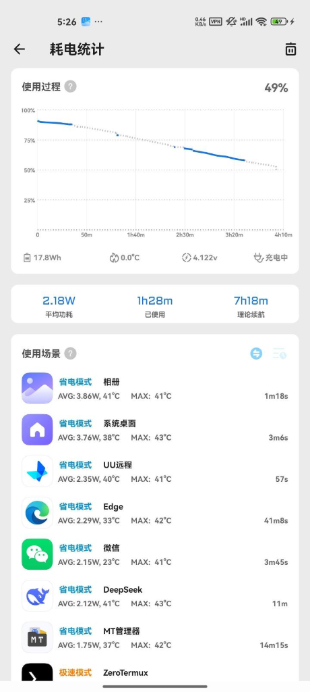

## 🚀 内核简介

这是由 **bggRGjQaUbCoE** 维护的小米11 (venus) 定制内核，版本为 **beta1**。

### 📋 功能特性
- **系统支持**: 支持 MIUI 和 HyperOS 1-2。
- **虚拟化支持**: 已添加 **LXC** 和 **Docker** 内核配置。
- **管理器集成**: 同时编译了 **KernelSU-Next** 和 **SukiSU Ultra** 两种管理器，可根据个人喜好选择。
- **系统适配**: 已支持 ColorOS 15 for Mi11 (斷水流)。
- **开发动态**: 
  - SuSFS: 暂不支持。
  - kpm: 后续计划支持。

---

## ✨ 核心特性

### 1. 充电特性 (玄学)
- 充电显示有时可能不会显示快充图标，但通过 **Scene** 查看确有快充电流。
- 充电状态显示可能存在延迟，建议使用 Scene 实时监测充电功率。

### 2. 功耗表现
- 主打省电，平均功耗仅在 **2.x W** 左右，表现优异。

*平均功耗 2.18W，表现出色*

---

## 🔗 相关链接

- **内核源码存储库**: [bggRGjQaUbCoE/android_kernel_xiaomi_sm8350-Voyager](https://github.com/bggRGjQaUbCoE/android_kernel_xiaomi_sm8350-Voyager)
- **内核文件下载**: [蓝奏云下载](https://wwqb.lanzout.com/b00yadr9id) (密码: `venus`)

::github{repo="bggRGjQaUbCoE/android_kernel_xiaomi_sm8350-Voyager"}

---

## 📸 运行截图

以下是内核在不同系统下的运行及功耗表现参考：

### SukiSU Ultra 管理器

*SukiSU Ultra 工作状态展示，内核版本 5.4.237-KernelSU-Next-LXC/Docker-2025.7.17*

### 系统信息 (ColorOS 15)

*Android 15 (Vanilla Ice Cream) 适配情况，支持 ColorOS 15 for Mi11*

---

#KernelSU.Next #SukiSUUltra #lxc #ColorOS15
